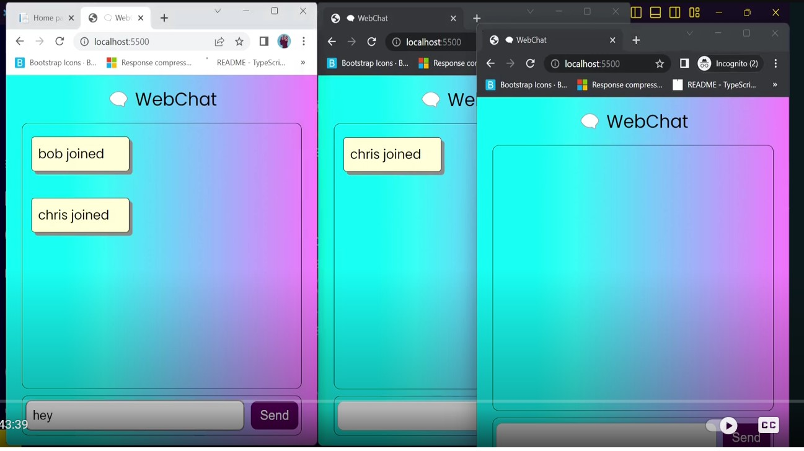

# WebChatServer

It is a `Chat Room server` made with signalR. It is a complete chat room application. It's backend written in `Signal R` and frontend written in `Vannila Js`. You can find the client application [here](https://github.com/rd003/WebChat-Client)

## Video Tutorial

You can find it's youtube tutorial [here](https://www.youtube.com/watch?v=XECRfpM3P4M)

## Tech Stack

- Dotnet 7 (Signal R)
- Node js (to install the signalr dependencies)
- Vanilla JS (frontend)

## How to run Server?

Open the `WebChatServer` and run with `dotnet run` command.

## How to run Client?

- Open the `WebChat-Client` app.
- In terminal run `npm install` to install the signal R dependencies.
- Install the `Live Server` extension and run `index.html` page with live server. Browser will be opened and you will see the url `http://localhost:5500/WebChat-Client/index.html`.

## Screenshots

